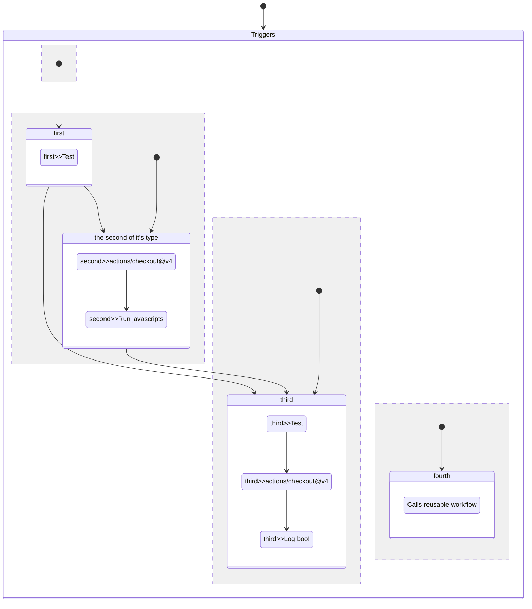

# Test workflow

This is a test workflow. And it is the best workflow.
This description has multiple lines.

There can be multiple paragraphs in a description. A paragraph is started after an empty comment line.
And the description ends at the first line that is not a comment.

## Workflow Diagram

## Triggers

### `workflow_call`

This workflow is reusable.

#### `workflow_call.inputs`

| Name | Description | Default | Required | Type |
| :--- | :---------- | :------ | :------: | :--- |
| yes | yes, what you gonna do bool? | john-doe |  | `string` |
| username | A username passed from the caller workflow | john-doe | * | `string` |

#### Secrets

| Name | Description | Required |
| :--- | :---------- | :------: |
| access-token | A token passed from the caller workflow | False |
| ten-ounce-id | An ounce of tenance to tell who is who | True |

#### Outputs

| Name | Description |
| :--- | :---------- |
| workflow_output1 | The first job output |
| workflow_output2 | The second job output |
| no | no, what you gonna do bool? |

### `workflow_dispatch`

This workflow can be manually triggered.

#### `workflow_dispatch.inputs`

| Name | Description | Default | Required | Type |
| :--- | :---------- | :------ | :------: | :--- |
| logLevel | Log level | warning | * | `choice`: <ul><li>info</li><li>warning</li><li>debug</li></ul> |
| print_tags | True to print to STDOUT |  | * | `boolean` |
| tags | Test scenario tags |  |  | `string` |
| environment | Environment to run tests against |  | * | `environment` |

### `workflow_run`

This workflow is triggered by the execution of other workflows.

#### `workflow_run.workflows`

- Upload data

#### `workflow_run.types`

- completed
